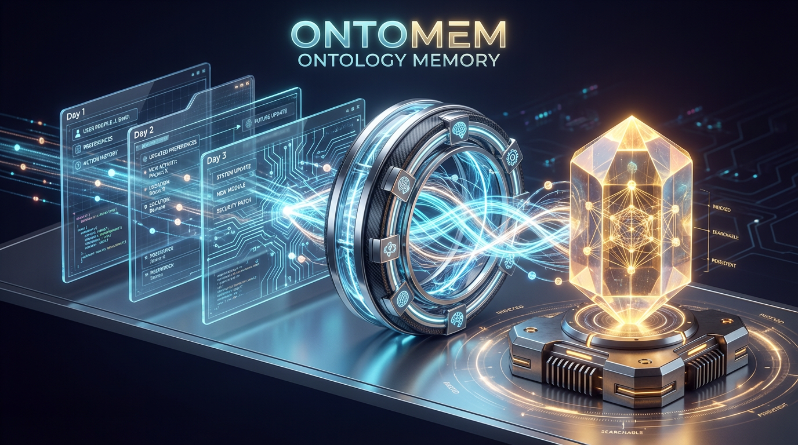

# 🧠 OntoMem: 自我整合的记忆系统

**OntoMem** 构建于*本体记忆*（Ontology Memory）的概念之上——为 AI 系统提供结构化、连贯的知识表示。

> **让你的 AI 智能体拥有"连贯"的记忆，而不仅仅是"碎片"的检索。**


<p align="center">
  
</p>

<div align="center">
<a href="https://pypi.org/project/ontomem/"></a>
<a href="https://www.python.org/"></a>
<a href="https://opensource.org/licenses/Apache-2.0"></a>
<a href="https://pypi.org/project/ontomem/"></a>
<a href="https://yifanfeng97.github.io/ontomem/"></a>
</div>

传统的 RAG（检索增强生成）系统检索文本碎片。**OntoMem** 采用 Pydantic 模式维护**结构化实体**，并通过智能合并算法自动将碎片化的观察融合为完整的知识图谱节点。

**它不仅仅存储数据——它持续"消化"和"组织"数据。**

---

## 📰 最新动态

- **[2026-01-21] v0.1.5 发布**:
  - **🎯 生产环境安全**: 新增 `max_workers` 参数控制 LLM 批量处理并发数
  - **⚡ 防止 API 限流**: 有效防止触发 OpenAI 等 LLM 提供商的速率限制，避免账户被限制
  - **🔧 细粒度并发控制**: 按合并策略自定义并发工作线程数（默认值: 5）
  - [了解更多 →](user-guide/merge-strategies.md#llm-并发控制)

- **[2026-01-19] v0.1.4 发布**:
  - **API 改进**: 将 `merge_strategy` 参数改名为 `strategy_or_merger`，更清晰且灵活
  - **增强功能**: 新增 `**kwargs` 支持，可直接通过 `OMem` 传入合并器特定参数（如 `CUSTOM_RULE` 的 `rule` 和 `dynamic_rule`），无需预配置
  - **优势**: 更简洁的 API 和更直观的高级合并使用方式
  - [了解更多 →](user-guide/merge-strategies.md)

- **[2026-01-19] v0.1.3 发布**:
  - **新特性**: 新增 `MergeStrategy.LLM.CUSTOM_RULE` 策略，支持用户自定义合并逻辑。直接向 LLM 合并器注入静态规则和动态上下文（通过函数）！
  - **破坏性变更**: 为提高清晰度，重命名了旧版策略名称：
    - `KEEP_OLD` → `KEEP_EXISTING`
    - `KEEP_NEW` → `KEEP_INCOMING`
    - `FIELD_MERGE` → `MERGE_FIELD`
  - [了解更多 →](user-guide/merge-strategies.md#自定义合并规则-custom-rules)


---

## ✨ 核心特性

### 🧩 Schema-First（模式优先）& 类型安全
基于 **Pydantic** 构建。所有记忆都是强类型对象。告别 `{"unknown": "dict"}` 的地狱，拥抱 IDE 自动补全和类型检查。

### 🔄 自动整合（Auto-Consolidation）
当你多次插入关于同一实体（相同 ID）的不同信息时，OntoMem 不会创建重复记录。它使用可配置的策略（字段覆盖、列表合并或 **LLM 驱动的智能融合**）将其智能合并为一条**黄金记录**。

### 🔍 混合搜索（Hybrid Search）
- **键值查询**：O(1) 精确实体访问
- **向量搜索**：内置 FAISS 索引用于语义相似性搜索，自动同步

### 💾 状态保持 & 持久化
将完整的记忆状态（结构化数据 + 向量索引）保存到磁盘，下次启动时可在秒级恢复。

---

## 🎯 使用场景

### 🤖 自我进化的 AI 智能体
在多轮对话中积累调试经验，逐步优化决策。

### 👤 个人知识图谱
从对话中构建活动的联系人档案，包括偏好、技能和交互历史。

### 🏢 企业数据中心
统一来自 CRM、电子邮件、支持工单和社交媒体的客户/员工记录。

### 📚 知识库整合
合并来自多个来源的重复或互补的信息，构建单一真实来源。

---

## 🚀 快速示例

```python
from ontomem import OMem, MergeStrategy
from pydantic import BaseModel
from langchain_openai import ChatOpenAI, OpenAIEmbeddings

# 定义模式
class BugFixExperience(BaseModel):
    error_signature: str
    solutions: list[str]
    prevention_tips: str

# 初始化记忆
memory = OMem(
    memory_schema=BugFixExperience,
    key_extractor=lambda x: x.error_signature,
    llm_client=ChatOpenAI(model="gpt-4o"),
    embedder=OpenAIEmbeddings(),
    strategy_or_merger=MergeStrategy.LLM.BALANCED
)

# 添加经验
memory.add(BugFixExperience(
    error_signature="ModuleNotFoundError: pandas",
    solutions=["pip install pandas"],
    prevention_tips="检查 requirements.txt"
))

# 查询
experience = memory.get("ModuleNotFoundError: pandas")
print(experience.solutions)  # 跨所有观察的自动合并！
```

---

## 📊 为什么选择 OntoMem？

大多数记忆库存储的是**原始文本**或**聊天记录**。OntoMem 存储的是**经过整合的知识**。

| 特性 | **OntoMem** 🧠 | **Mem0** / Zep | **LangChain Memory** | **向量数据库** (Pinecone/Chroma) |
| :--- | :--- | :--- | :--- | :--- |
| **核心存储单元** | ✅ **结构化对象** (Pydantic) | 文本切片 + 元数据 | 原始对话日志 | 向量 Embeddings |
| **数据"消化"能力** | ✅ **自动整合与逻辑合并** | 简单抽取 | ❌ 仅追加 (Append-only) | ❌ 仅追加 |
| **时间维度感知** | ✅ **时序切片** (按日/会话聚合) | ❌ 仅时间戳元数据 | ❌ 仅线性顺序 | ❌ 仅元数据过滤 |
| **冲突解决机制** | ✅ **LLM 智能逻辑** (综合/取舍) | ❌ 最后写入优先 | ❌ 无 | ❌ 无 |
| **类型安全** | ✅ **严格 Schema 约束** | ⚠️ 松散 JSON | ❌ 仅字符串 | ❌ 无 |
| **适用场景** | **长期 Agent 画像、动态知识图谱** | 简单 RAG、搜索增强 | 聊天机器人上下文 | 语义搜索 |

### 💡 "自动整合"的优势

- **传统 RAG/Memory**: 存储 50 条零散记录（如"Alice 喜欢苹果"、"Alice 喜欢香蕉"）。检索时返回 50 个碎片。
- **OntoMem**: 将其"消化"为 1 个对象：`User(name="Alice", likes=["苹果", "香蕉"])`。检索时返回**唯一的完整事实**。

---

## 🔗 下一步

- **[快速开始](quick-start.md)** - 5 分钟入门指南
- **[合并策略](../user-guide/merge-strategies.md)** - 了解不同的合并方法
- **[API 参考](../api/overview.md)** - 完整 API 文档

---

**由热爱记忆超越搜索的 AI 开发者用 ❤️ 构建。**
